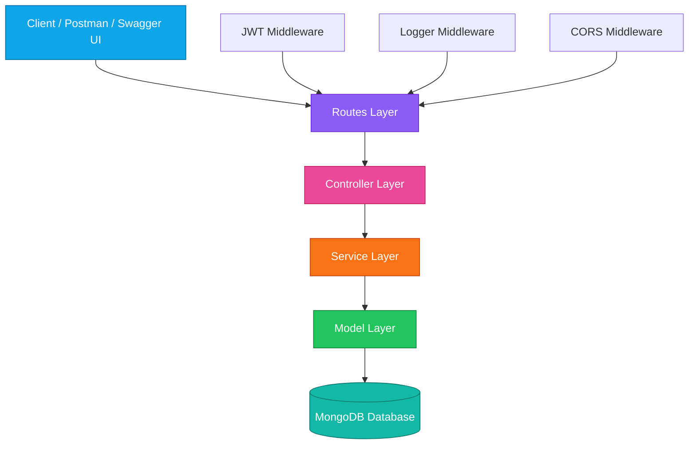
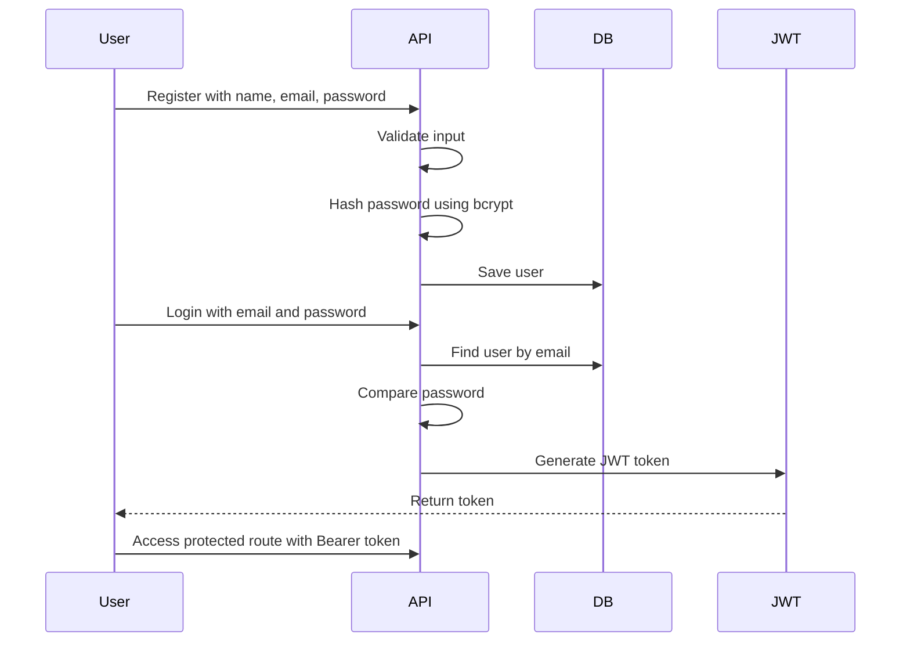

<div align="center">


<br/>


<br/><br/>


</div>

---

# 🏢 Enterprise User Product Management Backend System

A **scalable, modular, production-style backend system** built using **Node.js, Express.js, MongoDB, JWT, Swagger, and layered architecture**.

This project simulates a real-world enterprise backend where users, products, categories, subcategories, employees, authentication, authorization, file uploads, pagination, search, and soft delete are handled using clean backend engineering practices.

---

## 🌐 Live Project Links

<div align="center">

| 🚀 Platform           | 🔗 Link                                                |
| --------------------- | ------------------------------------------------------ |
| 🌍 Live Backend       | https://user-product-backend-api.onrender.com          |
| 📘 Swagger API Docs   | https://user-product-backend-api.onrender.com/api-docs |
| 🧪 Local Swagger Docs | http://localhost:4000/api-docs                         |
| 🔗 API Base URL       | `https://user-product-backend-api.onrender.com/api`    |

</div>

---

## 🧊 3D Project Snapshot

<div align="center">

<table>
  <tr>
    <td align="center" width="220">
      
      <h3>Secure Auth</h3>
      <p>JWT + bcrypt + protected routes</p>
    </td>
    <td align="center" width="220">
      
      <h3>MongoDB</h3>
      <p>Mongoose schemas + aggregation</p>
    </td>
    <td align="center" width="220">
      
      <h3>REST APIs</h3>
      <p>Modular service-based APIs</p>
    </td>
    <td align="center" width="220">
      
      <h3>Deployment</h3>
      <p>Live backend hosted on Render</p>
    </td>
  </tr>
</table>

</div>

---

## ✨ Key Highlights

* 🔐 Secure Authentication using **JWT & bcrypt**
* 🛡️ Role-Based Access Control for protected routes
* 👤 User Management with profile, education, and professional info
* 📦 Product Management with CRUD, search, pagination, availability toggle, and soft delete
* 🗂️ Category and SubCategory Management
* 👨‍💼 Employee Management with email and phone validation
* 📁 Profile Image Upload using Multer
* 📘 Swagger API Documentation
* 🪵 Custom Logging Middleware
* 🌐 CORS-enabled REST APIs
* 🧠 Clean Layered Architecture
* 🔄 Soft Delete Support for safer data handling
* 🚀 Deployed on Render

---

## 🧠 Architecture Flow



---

## 🏗️ Project Structure

```txt
user-product-backend-api/
│
├── controller/
│   ├── userController.js
│   ├── productController.js
│   ├── categoryController.js
│   ├── subCategoryController.js
│   └── employeeController.js
│
├── database/
│   └── db.js
│
├── models/
│   ├── user.js
│   ├── product.js
│   ├── category.js
│   ├── subcategory.js
│   └── employee.js
│
├── routes/
│   └── apis.js
│
├── services/
│   ├── auth.js
│   ├── productService.js
│   ├── categoryService.js
│   ├── subCategoryService.js
│   └── employeeService.js
│
├── uilites/
│   ├── helper.js
│   ├── access.js
│   ├── blacklist.js
│   ├── logger.js
│   └── phoneNumberValidator.js
│
├── swagger/
│   ├── swagger.js
│   └── components.js
│
├── paths/
│   ├── authSwagger.js
│   ├── categorySwagger.js
│   ├── subCategorySwagger.js
│   ├── productSwagger.js
│   └── employeeSwagger.js
│
├── uploads/
├── .env
├── server.js
├── package.json
└── README.md
```

---

## ⚙️ Tech Stack

<div align="center">


</div>

<br/>

| Technology         | Usage                      |
| ------------------ | -------------------------- |
| Node.js            | Backend runtime            |
| Express.js         | REST API framework         |
| MongoDB            | Database                   |
| Mongoose           | ODM for MongoDB            |
| JWT                | Authentication             |
| bcrypt             | Password hashing           |
| Multer             | File upload                |
| Swagger UI         | API documentation          |
| dotenv             | Environment variables      |
| CORS               | Cross-origin access        |
| validator          | Email validation           |
| password-validator | Strong password validation |

---

## 🔐 Authentication System



### Auth Features

* User registration
* Strong password validation
* Password hashing with bcrypt
* Secure login
* JWT token generation
* Token verification middleware
* Logout using token blacklist
* Admin/User role support

---

## 📦 Core Modules

<div align="center">

| Module                 | Features                                                   |
| ---------------------- | ---------------------------------------------------------- |
| 🔐 Auth Service        | Register, Login, Logout, Token Verify, Admin Activation    |
| 👤 User Service        | Users, Profile, Education, Professional Info, Image Upload |
| 📦 Product Service     | CRUD, Availability Toggle, Pagination, Search, Soft Delete |
| 🗂️ Category Service   | Create, Fetch, Update, Soft Delete                         |
| 🧾 SubCategory Service | Category Mapping, Duplicate Prevention, CRUD               |
| 👨‍💼 Employee Service | Employee CRUD, Email Validation, Phone Validation          |

</div>

---

## 📡 API Overview

### 🔐 Auth Service

| Method | Endpoint                 | Description                       |
| ------ | ------------------------ | --------------------------------- |
| POST   | `/api/register`          | Register new user                 |
| POST   | `/api/login`             | Login user and generate JWT       |
| POST   | `/api/logout`            | Logout user                       |
| GET    | `/api/verify-token`      | Verify JWT token                  |
| PUT    | `/api/user-to-admin/:id` | Activate or deactivate admin role |

---

### 👤 User Service

| Method | Endpoint                    | Description              |
| ------ | --------------------------- | ------------------------ |
| GET    | `/api/get-all-user`         | Get all users            |
| GET    | `/api/get-user-id/:id`      | Get user by ID           |
| PUT    | `/api/update-user/:id`      | Update user              |
| PUT    | `/api/soft-Delete-user/:id` | Soft delete user         |
| POST   | `/api/image-upload`         | Upload profile image     |
| POST   | `/api/create-educationinfo` | Add education info       |
| PUT    | `/api/update-educationinfo` | Update education info    |
| POST   | `/api/delete-educationInfo` | Delete education info    |
| POST   | `/api/create-profInfo`      | Add professional info    |
| PUT    | `/api/update-profInfo`      | Update professional info |
| POST   | `/api/delete-profInfo`      | Delete professional info |

---

### 📦 Product Service

| Method | Endpoint                       | Description                           |
| ------ | ------------------------------ | ------------------------------------- |
| POST   | `/api/create-product`          | Create product or toggle availability |
| GET    | `/api/get-all-product`         | Get all products                      |
| GET    | `/api/get-product-id/:id`      | Get product by ID                     |
| PUT    | `/api/update-product-id/:id`   | Update product                        |
| DELETE | `/api/soft-delete-product/:id` | Soft delete product                   |

---

### 🗂️ Category Service

| Method | Endpoint                   | Description          |
| ------ | -------------------------- | -------------------- |
| POST   | `/api/create-category`     | Create category      |
| GET    | `/api/get-all-categories`  | Get all categories   |
| PUT    | `/api/update-category/:id` | Update category      |
| DELETE | `/api/delete-category/:id` | Soft delete category |

---

### 🧾 SubCategory Service

| Method | Endpoint                      | Description             |
| ------ | ----------------------------- | ----------------------- |
| POST   | `/api/create-subCategory`     | Create subcategory      |
| GET    | `/api/get-all-subCategory`    | Get all subcategories   |
| PUT    | `/api/update-subCategory/:id` | Update subcategory      |
| DELETE | `/api/delete-subCategory/:id` | Soft delete subcategory |

---

### 👨‍💼 Employee Service

| Method | Endpoint                      | Description          |
| ------ | ----------------------------- | -------------------- |
| POST   | `/api/create-employee`        | Create employee      |
| GET    | `/api/get-all-employees`      | Get all employees    |
| PUT    | `/api/update-employee-id/:id` | Update employee      |
| DELETE | `/api/delete-employee-id/:id` | Soft delete employee |

---

## 📘 Swagger Documentation

Swagger UI is integrated for testing and exploring APIs directly from the browser.

<div align="center">

[](https://user-product-backend-api.onrender.com/api-docs)

</div>

### Swagger Links

```txt
Local:
http://localhost:4000/api-docs

Production:
https://user-product-backend-api.onrender.com/api-docs
```

---

## 🧪 Sample API Requests

### Register User

```json
{
  "name": "Omeshwar Reddy",
  "email": "omeshwar@example.com",
  "password": "Password@123",
  "confirm_password": "Password@123"
}
```

### Login User

```json
{
  "email": "omeshwar@example.com",
  "password": "Password@123"
}
```

### Protected API Header

```txt
Authorization: Bearer your_jwt_token_here
```

---

## 📁 File Upload System

Profile image upload is implemented using **Multer**.

```txt
Local:
http://localhost:4000/uploads/filename.jpg

Production:
https://user-product-backend-api.onrender.com/uploads/filename.jpg
```

---

## 🚀 Getting Started Locally

### 1. Clone Repository

```bash
git clone https://github.com/omeshwarreddykona/user-product-backend-api.git
cd user-product-backend-api
```

### 2. Install Dependencies

```bash
npm install
```

### 3. Create `.env` File

```env
PORT=4000
DB_URL=your_mongodb_connection_string
SECRET=your_jwt_secret_key
```

### 4. Start Server

```bash
npm run dev
```

or

```bash
npm start
```

Server runs at:

```txt
http://localhost:4000
```

Swagger runs at:

```txt
http://localhost:4000/api-docs
```

---

## 🧩 Environment Variables

| Variable | Description               |
| -------- | ------------------------- |
| `PORT`   | Backend server port       |
| `DB_URL` | MongoDB connection string |
| `SECRET` | JWT secret key            |

---

## 🛡️ Security Features

* 🔐 JWT Authentication
* 🔒 bcrypt Password Hashing
* 🛡️ Role-Based Access Control
* 🚪 Protected Routes
* 🚫 Token Blacklist on Logout
* ✅ Input Validation
* 🌐 CORS Configuration
* 🧹 Soft Delete Strategy

---

## 📌 Backend Engineering Concepts Used

* RESTful API Design
* MVC Architecture
* Service Layer Pattern
* Middleware Pattern
* JWT Authentication
* Role-Based Authorization
* MongoDB Aggregation
* Pagination
* Search Filtering
* Soft Delete Strategy
* File Upload Handling
* Custom Logger Middleware
* Environment Configuration
* Swagger API Documentation
* Deployment on Render

---

## 🔮 Future Improvements

* Redis caching
* Rate limiting
* Helmet security headers
* Unit testing with Jest
* Integration testing
* Docker containerization
* CI/CD pipeline
* Winston production logger
* API versioning
* Refresh token support

---

## 👨‍💻 Author

<div align="center">


### Backend Developer

### Node.js | Express.js | MongoDB | REST APIs

<br/>

[](https://omeshwar-portfolio.vercel.app)
[](https://www.linkedin.com/in/kona-omeshwar-reddy-60a0b72b4)
[](https://github.com/omeshwarreddykona)

</div>

---

<div align="center">


### ⭐ If you like this project, give it a star on GitHub.

</div>
